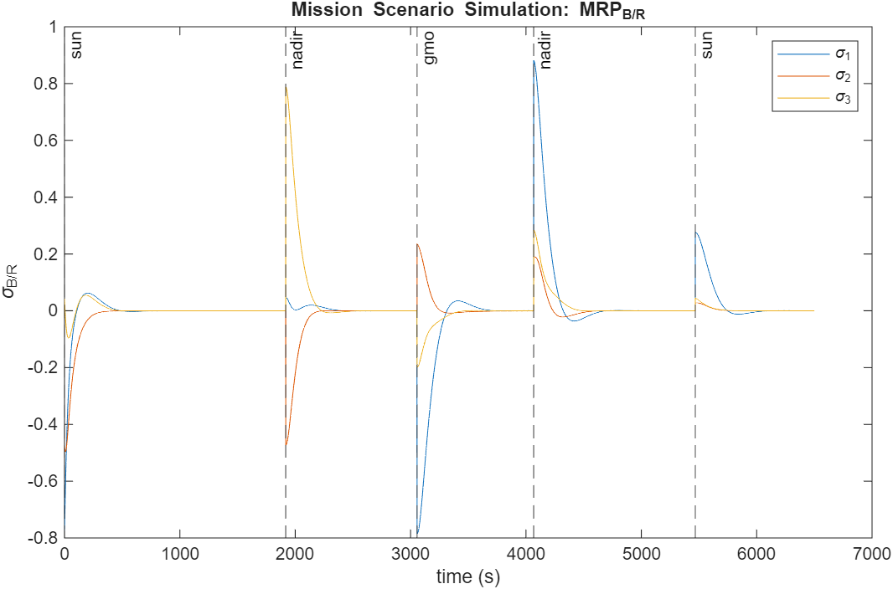
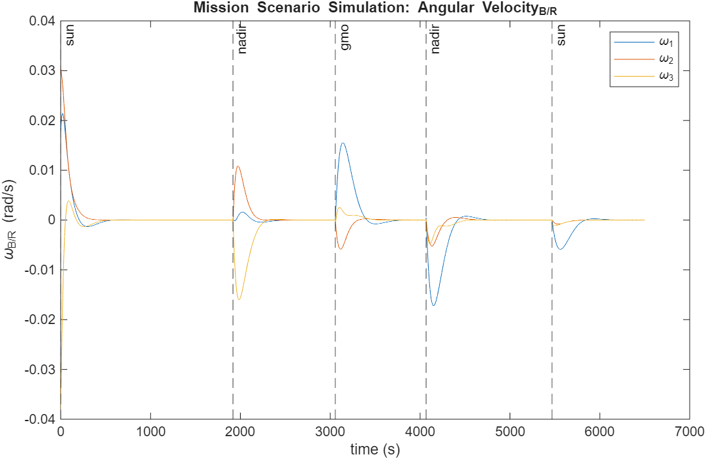

# Spacecraft Dynamics and Control

This repository contains a collection of MATLAB scripts for simulating spacecraft dynamics, attitude kinematics, and control systems. The project is structured as a series of modules covering fundamental concepts based on the [Coursera Specialization from the University of Colorado Boulder](https://www.coursera.org/specializations/spacecraft-dynamics-control), culminating in a comprehensive capstone project simulating a multi-mode Mars mission.

## Repository Structure

The code is organized into four main topics, followed by the capstone project:

*   **`1. Kinematics-Describing Motions of Spacecraft`**: Scripts for representing and converting between different attitude coordinate systems, including Direction Cosine Matrices (DCMs), Euler Angles, Principal Rotation Parameters (PRPs), Euler Parameters (Quaternions), and Modified Rodrigues Parameters (MRPs). It also includes implementations of attitude determination algorithms like the TRIAD method, Davenport's q-Method, and QUEST.

*   **`2. Kinetics-Studying Spacecraft Motion`**: Focuses on the rotational motion of rigid bodies. Scripts cover the calculation of kinetic energy, angular momentum, and the use of the inertia tensor and Parallel Axis Theorem.

*   **`3. Control of Nonlinear Spacecraft Attitude Motion`**: Implements various attitude control laws. This includes PD controllers for attitude stabilization and tracking, as well as integral control for disturbance rejection. Stability and control performance are analyzed through simulation.

*   **`4. Mars Mission - Capstone Project`**: A complete simulation of a daughter-craft in a Low Mars Orbit (LMO) performing a multi-mode attitude control mission.

## Key Concepts and Implementations

### Kinematics & Attitude Determination
*   **Attitude Representations**: Functions to convert between DCMs, Euler Angles, Quaternions (`beta`), and MRPs (`sigma`, `q`).
    *   `betaToDCM`, `DCMToBeta`, `sigmaToDCM`, `DCMToSigma`
*   **Kinematic Differential Equations**: Functions to propagate attitude, such as `B_sigma` for MRP kinematics.
*   **Attitude Determination**:
    *   TRIAD Method (`t_matrix.m`)
    *   Davenport's q-Method
    *   QUEST Method
    *   Optimal Linear Attitude Estimator (OLAE)

### Dynamics & Control
*   **Euler's Rotational Equations**: The core dynamics are modeled in `attitude_dyn.m`.
*   **PD Control Law**: A Proportional-Derivative controller is implemented to drive attitude errors to zero (`u = -K * sigma_BR - P * w_BR`).
*   **Numerical Integration**: A 4th-order Runge-Kutta integrator (`rk4_step.m`) is used to propagate the spacecraft state (attitude and angular velocity).

## Capstone Project: Mars Mission

The capstone project simulates a daughter-craft in a 400 km altitude Low Mars Orbit (LMO) and a mother-craft in a geosynchronous Mars orbit (GMO). The daughter-craft's mission is to autonomously switch between three attitude pointing modes based on its orbital position and communication needs.

### Mission Scenario
*   **Daughter-Craft**: Orbits Mars in a 30° inclination LMO.
*   **Mother-Craft**: Orbits Mars in a 0° inclination GMO.
*   **Control Objective**: The daughter-craft must maintain one of three attitudes:
    1.  **Sun-Pointing (`sun`)**: Point a specific body axis towards the sun for power generation. This mode is active when the spacecraft is on the sun-lit side of Mars (`y_N > 0`).
    2.  **Nadir-Pointing (`nadir`)**: Point a body axis towards the center of Mars. This is the default mode on the dark side of Mars.
    3.  **GMO-Pointing (`gmo`)**: Point a body axis towards the mother-craft for communication. This mode is active on the dark side of Mars when the angle between the daughter-craft and mother-craft is less than 35°.

### Main Scripts
*   **`mars_mission.m`**: The main script to run all tasks, simulations, and generate plots for the entire project.
*   **`getReferenceFrame.m`**: The core logic for the mission, determining the required reference frame (Sun, Nadir, or GMO) at any given time `t`.
*   **`final_simulation.m`**: Runs the complete mission scenario with autonomous mode switching.
*   **`simulate_mode.m`**: Simulates the spacecraft's behavior for a single, fixed pointing mode.
*   **`orbit_state.m`**: Calculates the position and velocity of a spacecraft in an inertial frame given its orbital elements.

### Running the Simulation
To run the full capstone project simulation and generate all associated plots and results:
1.  Open the repository in MATLAB.
2.  Navigate to the `4. Mars Mission - Capstone Project/` directory.
3.  Run the `mars_mission.m` script.

```matlab
% In MATLAB command window
>> mars_mission
```
The script will output results to the command window and generate figures illustrating the spacecraft's attitude (`sigma_B/N`), attitude error (`sigma_B/R`), angular velocity (`omega_B/N`), and control torque (`u`) over time. It also generates an attitude file (`LMO_attitude_new.a`) for visualization in STK.




